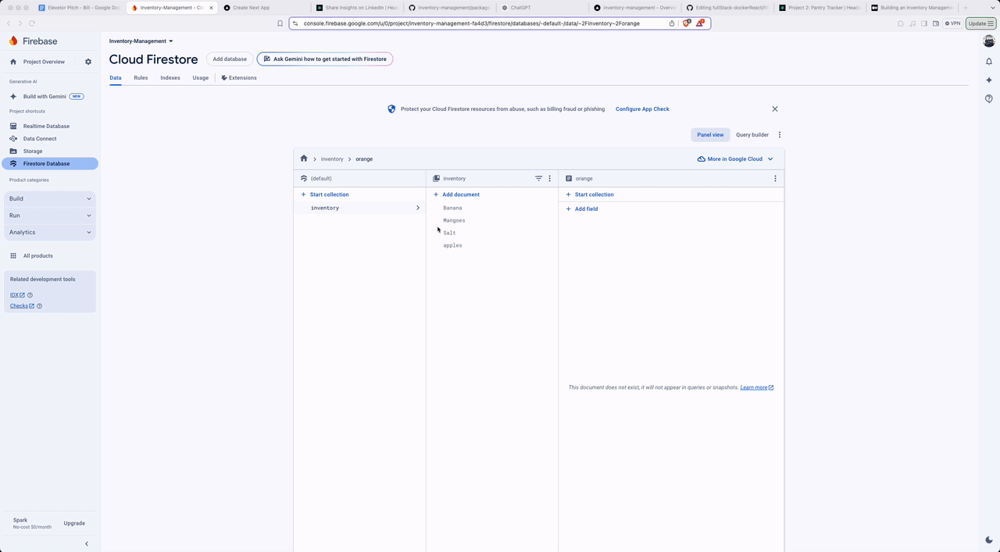

# Pantry App 👨🏻‍🍳
This is a web application designed to streamline the process of tracking and managing inventory. This application allows users to add, update, and remove items from their inventory while also uploading images of the items for better visualization. This is a [Next.js](https://nextjs.org/) project bootstrapped with [`create-next-app`]

## Installation 🏗️

# Getting Started

First, run the development server:

```bash
npm run dev
# or
yarn dev
# or
pnpm dev
# or
bun dev
```

Open [http://localhost:3000](http://localhost:3000) with your browser to see the result.

You can start editing the page by modifying `app/page.js`. The page auto-updates as you edit the file.

This project uses [`next/font`](https://nextjs.org/docs/basic-features/font-optimization) to automatically optimize and load Inter, a custom Google Font.

### Prerequisites

* Next.js: For building the server-side rendered front-end application.
* React: Integrated within Next.js for building the user interface components.
* Firebase Firestore: Used for backend database operations, providing real-time data synchronization.
* Firebase Storage: Handles image uploads and storage.
* Material-UI: Utilized for the UI components, offering a modern and responsive design.

## Deploy on Vercel

The easiest way to deploy your Next.js app is to use the [Vercel Platform](https://vercel.com/new?utm_medium=default-template&filter=next.js&utm_source=create-next-app&utm_campaign=create-next-app-readme) from the creators of Next.js.

Check out our [Next.js deployment documentation](https://nextjs.org/docs/deployment) for more details.


### Setup
1. Clone the repo
   bash<br>git clone https://github.com/MCdev92/inventory-management.git<br>
2. Install project dependencies:
   `npm install @mui/material @emotion/react @emotion/styled firebase` 
3. Set-up firebase:
    - Go to the Firebase Console and create a new project.
    - Once your project is created, click on “Add app” and select the web platform (</>).
    - Register your app with a nickname (e.g., “Inventory Management App”).
    - Copy the Firebase configuration object. We’ll use this in the next step.
4. Creating a Firebase configuration file:
    - Create a new file in your project’s `src` directory called `firebase.js` and add your Firebase configuration
    - Setup your firebase database and storage
5. Test the application:
    `npm run dev`
6. Navigate to `http://localhost:3000` 
    - Test the application by adding, removing and updating pantry items.

## Walkthrough/Demo


